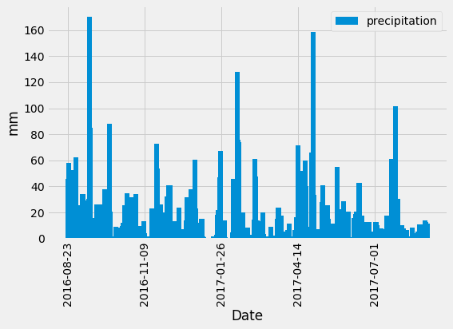

# Exploratory precipitation analysis using SQLalchemy ORM and Flask API route
## Overview
The notebook file (climate_starter.ipynb) contains a pandas/matplotlib analysis of a .sqlite database using sqlalchemy.ext.automapper and the inspector tool. The database is of climate measurements of six weather stations in Hawaii. The proceeding analysis looks at the precipitation and temperature readings over time.

The .py file contains code for API endpoint routes related to the sqlite database, built using Flask. There are two dynamic routes, where users can request temperature data within specified dates. Data is returned jsonified.

This was my first experience with the server-side of API requests.

## How to use
### Notebook file
imports datetime to use timedelta to find query dates.
imports sqlalchemy.ext.automap to reflect database tables, instead of creating the classes.
imports inspect from sqlalchemy to use inspector tool

### Flask API
To run date API request, enter date in yyyy-mm-dd format

